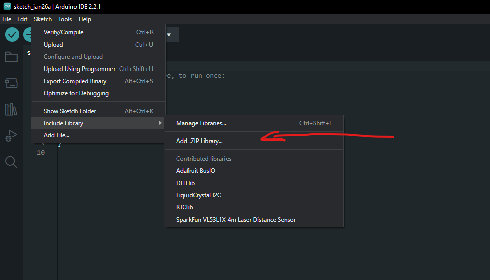
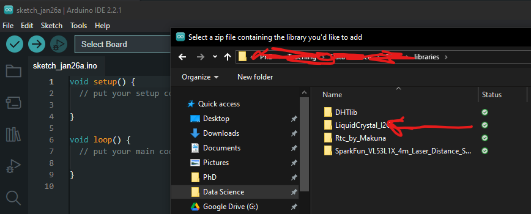

# Den store karse kop.


Dette dokument beskriver, hvordan man tester de enkelte komponenter i det store karse kop system. Test af de enkelte komponenter inden I sætter dem sammen, kan spare jer for meget tid og frustrationer forbundet med fejlfinding. Typiske årsager til fejl er:

- Forkert tilslutning af komponenter
- Manglende biblioteker
- Ledninger der ikke sidder ordentligt fast / er knækket

Lad ledningerne sidde i komponenten efter hver test.

## Test af Arduino Komponenter

### LiquidCrystal_I2C - 4 pin LCD display

LCD displayet skal bruges til at vise data fra de forskellige sensorer. Ved hele tiden at vise de forskellige sensorers output, kan man se om komponenterne stadig virker som de skal. Det er et 16x2 display, hvilket betyder at det kan vise 16 karakterer i bredden og 2 linjer i højden.
Detaljeret beskrivelse af LiquidCrystal_I2C biblioteket kan finde her: https://arduinogetstarted.com/tutorials/arduino-lcd-i2c?utm_content=cmp-true.

#### Installation

For at installere biblioteket download `LiquidCrystal_I2C.zip` filen i libraries mappen og installer den i Arduino IDE.




#### Forbindelser til Arduino Uno

På bagsiden af displayet er der vist en oversigt over de forskellige ben. For at tilslutte displayet til Arduino Uno, skal du bruge følgende forbindelser:

| LCD | Arduino Uno |
| --- | ----------- |
| GND | GND         |
| VCC | 5V          |
| SDA | A4          |
| SCL | A5          |


#### Kode til afprøvning

```c++
#include <Wire.h>
#include <LiquidCrystal_I2C.h>

// Først skal vi initialisere LCD-displayet og angiver dets dimensioner. Her er det 16 karakterer i bredden og 2 linjer i højden.
LiquidCrystal_I2C lcd(0x27, 16, 2);

void setup()
{
  // Start LCD displayet
  lcd.init();

  // Tænd baggrundslyset
  lcd.setBacklight((uint8_t)1);

  // Tilføj tekst til displayet
  lcd.print("Hello, world!");

  // Sæt cursor til at starte på linje 2
  lcd.setCursor(0,1);
  // Tilføj mere tekst
  lcd.print("Data Science");
}

void loop()
{
  // ...
}
```

- Initialisering: Funktionen `lcd.init()` initialiserer displayet og sætter det op til brug. Her definerer man også displayets dimensioner, som i eksemplet er sat til 16 karakterer i bredden og 2 linjer i højden.
- Baggrundslys: Funktionen `lcd.setBacklight()` styrer baggrundslyset på LCD-displayet, hvilket gør det muligt at se teksten under forskellige lysforhold.
- placering af Cursor: Med `lcd.setCursor()` kan man bestemme hvor på skærmen den efterfølgende tekst skal vises. Dette giver fleksibilitet i visningen af data.
- Visning af Tekst: Funktionen `lcd.print()` bruges til at vise tekst på displayet. Teksten kan indeholde bogstaver, tal og specialtegn.

### DHT11 - Temperatur og luftfugtighed

DHT11 er en almindeligt anvendt sensor til måling af temperatur og luftfugtighed, som er nem at anvende med mikrocontrollere som Arduino. Her er de primære funktioner for DHT11:

- Temperaturmåling: DHT11 kan måle omgivelsestemperaturen med en præcision på ±2°C og et måleområde fra 0°C til 50°C.
- Fugtighedsmåling: Sensoren kan også måle relativ luftfugtighed med en præcision på ±5% RH og i området fra 20% til 80% RH.
- Digital Signal Output: DHT11 sender data som et digitalt signal, hvilket reducerer risikoen for signalforstyrrelser over lange afstande.
- Enkel Interface: Sensoren kræver kun én digital pin på Arduino til dataoverførsel, samt en strømforsyning og jordforbindelse.

#### Installation

For at installere biblioteket download `DHTlib.zip` filen i libraries mappen og installer den i Arduino IDE.

#### Forbindelser til Arduino Uno

| DHT11 | Arduino Uno |
| ----- | ----------- |
| DATA  | 7           |
| VCC   | 5V          |
| GND   | GND         |


#### Kode til afprøvning

```c++
#include <dht.h>

dht DHT;

#define DHT11_PIN 7

void setup(){
  Serial.begin(9600);
}

void loop(){
  int chk = DHT.read11(DHT11_PIN);
  Serial.print("Temperature = ");
  Serial.println(DHT.temperature);
  Serial.print("Humidity = ");
  Serial.println(DHT.humidity);
  delay(1000);
}
```

I det ovenstående Arduino-kodeeksempel indlæses data fra DHT11-sensoren ved hjælp af DHT.read11(DHT11_PIN)-funktionen, hvor DHT11_PIN repræsenterer den digitale pin på Arduino-boardet, som sensoren er tilsluttet til. Når data er indlæst, kan temperatur og fugtighed aflæses fra DHT.temperature og DHT.humidity. Disse værdier udskrives derefter til seriel monitor hvert sekund (1000 millisekunder), som angivet af delay(1000)-funktionen.

### VL53L1X - Laser afstandsmåler

VL53L1X er en laser afstandsmåler sensor, der bruger en Time of Flight (ToF) sensor. Denne sensor kan måle afstande præcist ved at sende en laserpuls og måle den tid det tager for lyset at blive reflekteret tilbage til sensoren. Du kan læse mere om sensoren [her](https://www.waveshare.com/w/upload/7/7c/VL53L1X-Distance-Sensor-User-Manual-en.pdf).

#### Installation

For at installere biblioteket download `SparkFun_VL53L1X_4m_Laser_Distance_Sensor.zip` filen i libraries mappen og installer den i Arduino IDE.

#### Forbindelser til Arduino Uno

Indsæt 6PIN ledningen med hanner (dem med spids) i laserafstandsmåleren. Forbind nu laser afstandsmåleren til Arduino som vist nedenfor. Ignorer de kabler, som ikke forbindes til Arduino.

**OBS** Husk at fjerne vakumtapen fra afstandsmåleren.

| VL53L1X | Arduino Uno |
| ------- | ----------- |
| GND     | GND         |
| VCC     | 3.3V        |
| SDA     | SDA         |
| SCL     | SCL         |


#### Kode til afprøvning

```c++
#include <Wire.h>
#include "SparkFun_VL53L1X.h"

SFEVL53L1X distanceSensor;

void setup(void)
{
  Wire.begin();

  Serial.begin(9600);
  Serial.println("VL53L1X Qwiic Test");

  // Hvis sensoren finder en fejl under opstart, vil den fryse og udskrive en fejlmeddelelse.
  if (distanceSensor.begin() != 0)
  {
    Serial.println("Sensor failed to begin. Please check wiring. Freezing...");
    while (1)
      ;
  }
  Serial.println("Sensor online!");
}

void loop(){

  int distance = getDistance();

  Serial.print("Distance(mm): ");
  Serial.print(distance);

  float distanceCM = distance / 10;

  Serial.print("\tDistance(cm): ");
  Serial.print(distanceCM, 2);

  Serial.println();

  delay(1000);
}


// Funktion til at måle afstand
int getDistance() {
  distanceSensor.startRanging();
  while (!distanceSensor.checkForDataReady()) {
    delay(1);
  }
  int distance = distanceSensor.getDistance();
  distanceSensor.clearInterrupt();
  distanceSensor.stopRanging();

  return distance;
}


```

I det ovenstående Arduino-kodeeksempel oprettes et objekt SFEVL53L1X distanceSensor til at interagere med VL53L1X lasersensoren. I void setup()-funktionen initialiseres sensoren og der tjekkes for en succesfuld opstart, hvis afstand er forskellig fra 0. I void loop()-funktionen foretages kan distancen måles med getDistance(), hvor afstanden måles i millimeter. Disse værdier udskrives til serial monitor. Efter hver måling indføres en pause på et sekund (1000 millisekunder) med delay(1000)-funktionen, før den næste måling påbegyndes.

### SD kortlæser

SD kortlæseren bruges til at samle data op for fra jeres sensorer. En beskrivelse af modulet findes her: https://lastminuteengineers.com/arduino-micro-sd-card-module-tutorial/?utm_content=cmp-true

#### Forbindelser til Arduino Uno


#### Kode til afprøvning

```c++
//Følgende tre linjer SKAL være før void setup
#include <SPI.h>
#include <SD.h>
File myFile;

void setup() {
  Serial.begin(9600);

  while (!Serial) {
    ; // Vent på at seriel port er klar
  }
  Serial.print("Initializing SD card...");
  if (!SD.begin(10)) {   //Tallet i parentesen skal være det pinnummer, I har tildelt CS fra modulet til jeres SD-læser
    Serial.println("initialization failed!");
    while (1);
  }
  Serial.println("initialization done.");


// Du kan evt lave en heading i toppen af filen, hvor hver parameter (kolonne) bliver defineret ved navn. Hvis I gør dette, så indkludér dette i void loop
//myFile = SD.open("test.txt", FILE_WRITE);
  //myFile.print("Parameter 1");
  //myFile.print("\t"); //Dette angiver at vi starter en ny kolonne
  //myFile.println("Parameter 2"); //Den sidste kolonne, der er på en linje, skal kaldes "println" for at der starter en ny linje til næste skriv
//myFile.close();

}

void loop() {
  // følgende linjer kan indsættes i bunden af jeres loop, sådan at loopet afslutter med at gemme data
myFile = SD.open("test.txt", FILE_WRITE);

// if the file opened okay, write to it:
  if (myFile) {
   myFile.print("Parameter 1"); //Her skriver du, den værdi der skal gemmes for Parameter 1.
   myFile.print("\t"); //Dette angiver at vi starter en ny kolonne. Du kan altid tilføje paramtetre, der skal gemmes.
   myFile.println("Parameter 2"); //Her skriver du, den værdi der skal gemmes for Parameter 1. Den sidste kolonne, der er på en linje, skal kaldes "println" for at der starter en ny linje til næste skriv
   myFile.close();
   delay(1000);

  } else {
    // if the file didn't open, print an error:
    Serial.println("error opening test.txt");
  }

}
```

### RTC - Real Time Clock

Guide: https://electropeak.com/learn/interfacing-ds1302-real-time-clock-rtc-module-with-arduino/

#### Installation

Download `Rtc_by_Makuna.zip` filen i libraries mappen og installer den i Arduino IDE.

#### Forbindelser til Arduino Uno

| RTC | Arduino Uno |
| --- | ----------- |
| GND | GND         |
| VCC | 5V          |
| CLK | 5           |
| DAT | 4           |
| RST | 2           |


#### ISO 8601 format

Når I måler tiden er det vigtigt i bruger det rigtige format, da det vil spare jer en masse hovedpine senere, når I skal overføre data til R. I kurset bruger vi ISO 8601 formatet.

<details>
  <summary>Hvad er ISO 8601 format?</summary>
  ISO 8601 er en international standard for repræsentation af datoer og tidspunkter ved brug af tal. Den er særligt populær i computersystemer, hvor den bruges til at repræsentere den aktuelle dato og tid. Formatet er YYYY-MM-DDTHH:MM:SS, hvor T bruges til at adskille dato og tid.
</details>

#### Første gang I benytter clock modulet

Når I benytter clock modulet første gang, er det er god idé at inkludere følgende kode i void setup. Koden vil sætte dato og tid i jeres clock modul til tidspunktet, hvor I uploader jeres script til arduinoen. Dette skal kun gøres første gang I benytter clock modulet. Herefter skal I fjerne koden.

```C++
  RtcDateTime compiled = RtcDateTime(__DATE__, __TIME__);
  Rtc.SetDateTime(compiled);
```

#### Kode til afprøvning

```c++
#include <ThreeWire.h>
#include <RtcDS1302.h>

// RTC setup
ThreeWire myWire(4,5,2); // IO, SCLK, CE
RtcDS1302<ThreeWire> Rtc(myWire);

void setup() {
  Serial.begin(9600);

  // RTC
  Rtc.Begin();

  // Denne kode sætter dato og tid i jeres clock modul til tidspunktet, hvor I uploader jeres script til arduinoen.
  // Det er en god idé at inkludere denne kode første gang I benytter clock modulet.
  // Herefter skal I udkommentere koden.

  //RtcDateTime compiled = RtcDateTime(__DATE__, __TIME__);
  //Rtc.SetDateTime(compiled);
}

void loop() {
  // getIUPACTime() er en custom funktion I finder nederst, derreturnerer tid i ISO 8601 format
  String iupacTime = getIUPACTime();
  Serial.println(iupacTime);

  // delay for 1 second
  delay(1000);
}

//  Funktion til at hente tid fra RTC
String getIUPACTime() {
    // Få tid fra RTC
    RtcDateTime now = Rtc.GetDateTime();
    String dateTime;

    // år
    dateTime += String(now.Year());
    dateTime += '-';

    // måned
    if (now.Month() < 10) dateTime += '0';
    dateTime += String(now.Month());
    dateTime += '-';

    // dag
    if (now.Day() < 10) dateTime += '0';
    dateTime += String(now.Day());

    dateTime += 'T'; // T er brugt til at adskille dato og tid i ISO 8601 format

    // tid
    if (now.Hour() < 10) dateTime += '0';
    dateTime += String(now.Hour());
    dateTime += ':';

    // Minuter
    if (now.Minute() < 10) dateTime += '0';
    dateTime += String(now.Minute());
    dateTime += ':';

    // Sekunder
    if (now.Second() < 10) dateTime += '0';
    dateTime += String(now.Second());

    return dateTime;
}
```

### Light Sensor (Photoresistor)

En lyssensor eller fotoresistor er en type resistor, hvis modstand ændrer sig afhængigt af mængden af lys, den bliver udsat for. Generelt set, når lyset bliver stærkere, falder modstanden, og når det er mørkere, stiger modstanden. Fotoresistorer er ofte anvendt i elektroniske projekter, hvor der er brug for en simpel og billig måde at måle lysintensitet.

Guide: https://www.instructables.com/How-to-use-a-photoresistor-or-photocell-Arduino-Tu/

#### Installation

Det er ikke nødvendigt at installere et biblotek for denne komponent.
**OBS** Anvend en 10 KOhm modstand.

#### Forbindelser til Arduino Uno


#### Kode til afprøvning

```c++
int sensorValue = 0;

void setup()
{
  pinMode(A0, INPUT);
  Serial.begin(9600);
}

void loop()
{
  // read the value from the sensor
  int lightRaw = analogRead(A0);
  // print the sensor reading so you know its range
  int light = map(lightRaw, 0, 1023, 0, 100);
  Serial.println(light);

  delay(1000); // Wait for 1 second

}
```

## Sammensætning af 2 komponenter

Her vises et simpelt arduino script, hvor I kan se hvordan man måler temperaturen og fugtigheden med DHT11 og viser det på LCD displayet.

### LCD og DHT11

```c++
#include <Wire.h>
#include <LiquidCrystal_I2C.h>
#include <dht.h>

// LCD setup
LiquidCrystal_I2C lcd(0x27, 16, 2);

// DHT setup
dht DHT;
#define DHT11_PIN 7

void setup() {
  Serial.begin(9600);

  // start LCD
  lcd.init();
  lcd.setBacklight((uint8_t)1);

}

void loop() {
  // Læst temperatur og fugtighed
  int chk = DHT.read11(DHT11_PIN);
  float temperature = DHT.temperature;
  float humidity = DHT.humidity;

  // Vis data på LCD
  lcd.clear();
  lcd.setCursor(0, 0);
  lcd.print("Temp: ");
  lcd.print(temperature);
  lcd.print("C ");
  lcd.setCursor(0, 1);
  lcd.print("Humidity: ");
  lcd.print(humidity);
  lcd.print("%");

  // Vent 2 sekunder
  delay(2000);
}
```
