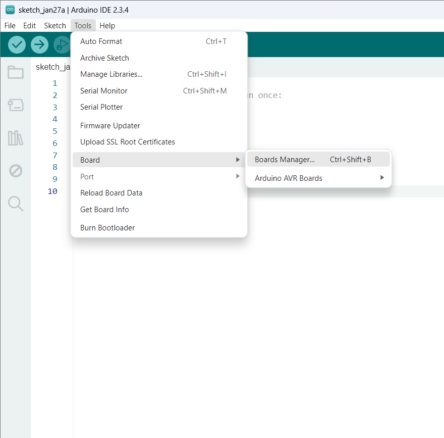
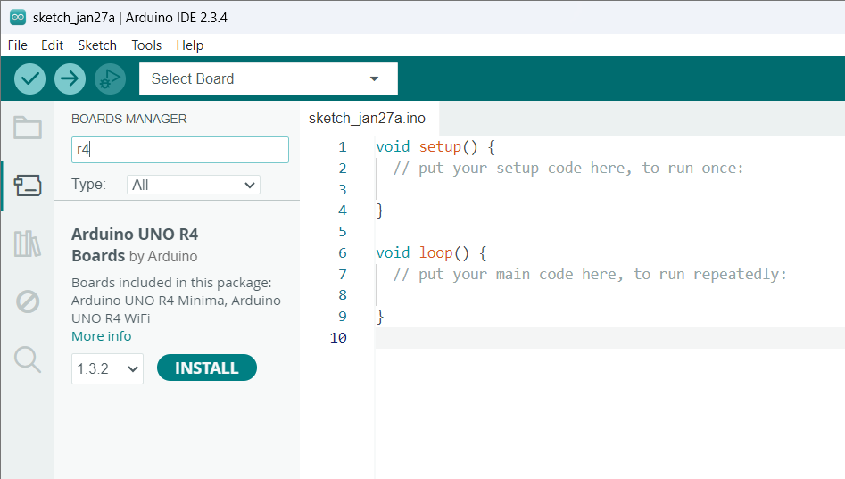
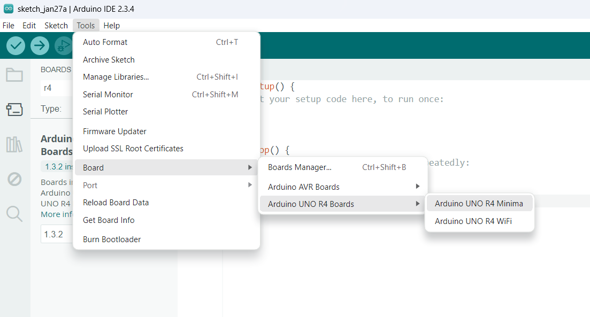

# Den Store Surdejskonkurrence med Arduino Uno

Denne github side indeholder dokumentation om den store surdejskonkurrence.


## Kom igang med Arduino UNO R4 minima

For at kunne arbejde med jeres arduino skal i først installere Arduino IDE 2.3.4. I kan downloade installationsfilen her:
https://www.arduino.cc/en/software.
Når I klikker på den installation, som passer jeres styresystem, så skal I blot vælge "just download" et par gange for at komme videre.
Åben installationsfilen og følg vejledningen. 
Når I åbner programmet første gang, så kan det godt være, at I skal give nogle tilladelser igennem jeres firewall.
Desuden skal I installere en passende driver til jeres board:
Vælg **Tools > Board > Boards Manager**, og derefter søg på r4 i søgefeltet. Installer driveren `Arduino UNO R4 Boards v1.3.2`.



Vælg nu jeres board type under **Tools > Board > Arduino UNO R4 Boards > Arduino UNO R4 Minima**

Hvis I genstarter jeres IDE, så skal i muligvis genvælge den ønskede board type.
Forbind jeres arduino til computeren med USB-kablet, og vælg den relevante port under **Tools > Port**.

Installation og setup er nu færdig, og I er klar til at kode jeres arduino!

## How to code (Quick guide)

Arduino-programmer (sketches) består altid af to hovedfunktioner:

```c++
void setup() {
  // Kører én gang, når Arduino starter.
}

void loop() {
  // Kører gentagne gange, så længe Arduino er tændt.
}
```

Hvis du bruger sensorer eller moduler, skal du muligvis tilføje biblioteker. Gør sådan:

Gå til **Tools > Manage Libraries**.
Søg efter det relevante bibliotek (f.eks. "Adafruit Sensor" eller "LiquidCrystal").
Klik på "Install".

Derefter skal du inkludere biblioteket i toppen af din kode før void-setup():

```c++
#include <Wire.h>          
#include <LiquidCrystal.h>
```

Den generelle kode procedure til eksterne komponenter som sensorer eller motorer er
1) Indlæs relevante biblioteker
2) Initialiser moduler/sensorer i setup()
3) Læs data fra sensor eller styr moduler i loop()

For kode eksempler se [Guide til komponenter](./guide_til_komponenter.md).

Når du tror, at du har en færdig kode klar til at blive uploadet til arduino boardet kan du trykke `Verify` øverst i venstre hjørne for at teste koden. Hvis den ikke melder fejl kan du `Upload` koden til arduino boardet.

**Pro tip**: Brug mange kommentarer (//) i din kode for at holde overblik.

## Komponenter
I jeres kasse fra Arduino tech har i modtaget flere komponenter, som kan forbindes til jeres arduino. I den store surdejskonkurrence skal I som minimum bruge et LCD display, en temperatur- og luftfugtighedsmåler, en laser afstandsmåler, og en SD kortlæser.
Der lavet en vejledning til hver af disse komponenter på siden her:
[Guide til komponenter](./guide_til_komponenter.md)

## Den store surdejskonkurrence - spillets regler

I skal lave en opstilling der løbende opsamler data når jeres surdejsstarter vokser. Som minumum skal der opsamles højde, temperatur og fugtighed, og det hele skal vises løbende på et display, samt gemmes på et SD kort. Hvis man har lyst må man gerne forsøge sig med de andre komponenter i kassen fra Arduino tech. Der er blandt andet en lys-resistor, som der kan måle lysintensitet.

Der skal som minimum udføres følgende 3 (successfulde) forsøg over 5 kursusgange: A) Vækst med almindelig hvedemel, B) vækst med fuldkornshvedemel, C) vækst med rugmel. Alle forsøg foregår ved stuetemperatur. Der skal måles fra forsøgsstart til at surdejen er toppet og faldet sammen igen (Cirka 7 timer).

Inspiration til yderligere forsøg: Høj/lav temperatur, høj/lav fugtighed, lys/mørke, honning, andre meltyper (f.eks. tipo00, ølandshvedemel, speltmel)

Jeres data vil blive brugt i efterfølgende forelæsninger til import af data, visualisering af data, lineær regression, mv., for blandt andet at undersøge, hvornår og hvor hurtigt surdejsstarteren vokser.

I får udleveret bøtter, mel og en surdej til jeres eksperiment. For at gøre eksperimenterne sammenlignelig, skal I til hvert eksperiment bruge følgende forhold af vand, mel og surdej.
- 2 scoop mel
- 50 mL vand
- 1 scoop surdej

Når I blander dette grundigt sammen, skal jeres surdejsblanding opnå en konsistens der svarer til en flydende grød eller en 9% creme fraiche. Hvis I bruger rugmel kan det være at I skal tilføje en smule mere vand for at opnå rette konsistens.

## Vinder parametre
- Højeste relative hævehøjde
- Hurtigeste vækst
- Flest forsøg
- Flotteste arduino kode
- Flotteste R-markdown rapport


## Praktisk

Vi kommer til at medbringe mel og surdej til hver kursusgang, men I er meget velkomne til selv at starte en surdej op. Det kunne være lidt sjovt, at se hvem der kunne lave den bedste surdejsstarter. Se guiden [her](./surdejsguide.md). Vi vil også foretrække, hvis I selv kan stå for at fodre jeres surdej, og tage den med til hver kursusgang. Dette er selvfølgelig ikke et krav, og vi kommer også til at medbringe vækstklar surdej til de af jer, som har behov for det. Men for at undgå melspild, så giv gerne Jeppe et prik på skulderen, hvis I planlægger selv at holde jeres surdej i live.

Hvis I selv har prøvet at bage pizza, brød, boller mm. derhjemme, så ved I også at mel sviner helt vildt. For derfor at undgå at skulle svinge kosten alt for meget efter hver kursusgang, så vil vi foretrække, hvis I vil blande jeres surdej i området, hvor I får udleveret mel og surdej. Når I senere vasker jeres bøtter, så forsøg at hælde så meget surdej ud i skraldespanden før I vasker bøtten. Renggør også gerne vasken for dejrester efterfølgende. De sætter sig altid godt fast. Tak!

## FAQ
