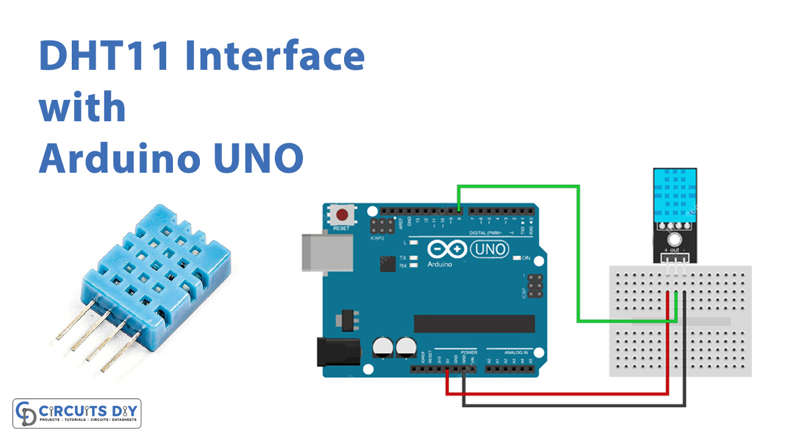

# Den store karse kop.

Dette dokument beskriver, hvordan man tester de enkelte komponenter i det store karse kop system. Test af de enkelte komponenter inden I sætter dem sammen, kan spare jer for meget tid og frustrationer forbundet med fejlfinding. Typiske årsager til fejl er:

- Forkert tilslutning af komponenter
- Manglende biblioteker
- Ledninger der ikke sidder ordentligt fast / er knækket

Lad ledningerne sidde i komponenten efter hver test.

## Test af Arduino Komponenter

### LiquidCrystal_I2C - 4 pin LCD display

LCD displayet skal bruges til at vise data fra de forskellige sensorer. Ved hele tiden at vise de forskellige sensorers output, kan man se om komponenterne stadig virker som de skal. Det er et 16x2 display, hvilket betyder at det kan vise 16 karakterer i bredden og 2 linjer i højden.
Detaljeret beskrivelse af LiquidCrystal_I2C biblioteket kan finde her: https://arduinogetstarted.com/tutorials/arduino-lcd-i2c?utm_content=cmp-true.

#### Installation

For at installere biblioteket, gå til Tools -> Manage Libraries og søg efter "LiquidCrystal_I2C". Installer biblioteket vist på billedet.

> Det er vigtigt at du vælger det rigtige bibliotek, da der findes flere forskellige versioner.


#### Forbindelser til Arduino Uno

På bagsiden af displayet er der vist en oversigt over de forskellige ben. For at tilslutte displayet til Arduino Uno, skal du bruge følgende forbindelser:

| LCD | Arduino Uno |
| --- | ----------- |
| GND | GND         |
| VCC | 5V          |
| SDA | A4          |
| SCL | A5          |


#### Kode til afprøvning

```c++
#include <Wire.h>
#include <LiquidCrystal_I2C.h>

// Set the LCD address to 0x27 for a 16 chars and 2 line display
LiquidCrystal_I2C lcd(0x27, 16, 2);

void setup()
{
  // initialize the LCD
  lcd.begin();

  // Turn on the blacklight
  lcd.setBacklight((uint8_t)1);

  // First row
  lcd.print("Hello, world!");

  // Second row
  lcd.setCursor(0,1);
  lcd.print("Data Science");
}

void loop()
{
  // Do nothing here...
}
```

- Initialisering: Funktionen `lcd.begin()` initialiserer displayet og sætter det op til brug. Her definerer man også displayets dimensioner, som i eksemplet er sat til 16 karakterer i bredden og 2 linjer i højden.
- Baggrundslys: Funktionen `lcd.setBacklight()` styrer baggrundslyset på LCD-displayet, hvilket gør det muligt at se teksten under forskellige lysforhold.
- placering af Cursor: Med `lcd.setCursor()` kan man bestemme hvor på skærmen den efterfølgende tekst skal vises. Dette giver fleksibilitet i visningen af data.
- Visning af Tekst: Funktionen `lcd.print()` bruges til at vise tekst på displayet. Teksten kan indeholde bogstaver, tal og specialtegn.

### DHT11 - Temperatur og luftfugtighed

DHT11 er en almindeligt anvendt sensor til måling af temperatur og luftfugtighed, som er nem at anvende med mikrocontrollere som Arduino. Her er de primære funktioner for DHT11:

- Temperaturmåling: DHT11 kan måle omgivelsestemperaturen med en præcision på ±2°C og et måleområde fra 0°C til 50°C.
- Fugtighedsmåling: Sensoren kan også måle relativ luftfugtighed med en præcision på ±5% RH og i området fra 20% til 80% RH.
- Digital Signal Output: DHT11 sender data som et digitalt signal, hvilket reducerer risikoen for signalforstyrrelser over lange afstande.
- Enkel Interface: Sensoren kræver kun én digital pin på Arduino til dataoverførsel, samt en strømforsyning og jordforbindelse.

Der findes mange biblioteker og udgaver. Den version I har er 3-pins versionen beskrevet her: https://www.circuitbasics.com/how-to-set-up-the-dht11-humidity-sensor-on-an-arduino/

#### Forbindelser til Arduino Uno

| DHT11 | Arduino Uno |
| ----- | ----------- |
| DATA  | 7           |
| VCC   | 5V          |
| GND   | GND         |



#### Kode til afprøvning

```c++
#include <dht.h>

dht DHT;

#define DHT11_PIN 7

void setup(){
  Serial.begin(9600);
}

void loop(){
  int chk = DHT.read11(DHT11_PIN);
  Serial.print("Temperature = ");
  Serial.println(DHT.temperature);
  Serial.print("Humidity = ");
  Serial.println(DHT.humidity);
  delay(1000);
}
```

I det ovenstående Arduino-kodeeksempel indlæses data fra DHT11-sensoren ved hjælp af DHT.read11(DHT11_PIN)-funktionen, hvor DHT11_PIN repræsenterer den digitale pin på Arduino-boardet, som sensoren er tilsluttet til. Når data er indlæst, kan temperatur og fugtighed aflæses fra DHT.temperature og DHT.humidity. Disse værdier udskrives derefter til seriel monitor hvert sekund (1000 millisekunder), som angivet af delay(1000)-funktionen.

### SparkFun VL53L1X - Laser afstandsmåler

SparkFun VL53L1X er en laser afstandsmåler sensor, der bruger en Time of Flight (ToF) sensor. Denne sensor kan måle afstande præcist ved at sende en laserpuls og måle den tid det tager for lyset at blive reflekteret tilbage til sensoren. Her er nogle af de centrale funktioner for SparkFun VL53L1X:

- Lang Rækkevidde: Sensoren kan måle afstande fra 40mm op til 4 meter, hvilket er betydeligt længere end mange andre ToF-sensorer.
- Høj Nøjagtighed: VL53L1X tilbyder en imponerende nøjagtighed på ±5mm i optimal betingelser.
- Beskrivelse: https://github.com/sparkfun/SparkFun_VL53L1X_Arduino_Library

#### Installation

Kopier følgende ind i Arduino IDE og klik på linket og installer biblioteket.

```c++
//Click here to get the library: http://librarymanager/All#SparkFun_VL53L1X
```


#### Forbindelser til Arduino Uno

| VL53L1X | Arduino Uno |
| ------- | ----------- |
| SORT    | GND         |
| RØD     | 3.3V        |
| BLÅ     | SDA         |
| GUL     | SCL         |

#### Kode til afprøvning

```c++
/*
  Reading distance from the laser based VL53L1X
  By: Nathan Seidle
  SparkFun Electronics
  Date: April 4th, 2018
  License: This code is public domain but you buy me a beer if you use this and we meet someday (Beerware license).

  SparkFun labored with love to create this code. Feel like supporting open source hardware?
  Buy a board from SparkFun! https://www.sparkfun.com/products/14667

  This example prints the distance to an object.

  Are you getting weird readings? Be sure the vacuum tape has been removed from the sensor.
*/

#include <Wire.h>
#include "SparkFun_VL53L1X.h" //Click here to get the library: http://librarymanager/All#SparkFun_VL53L1X


SFEVL53L1X distanceSensor;
//Uncomment the following line to use the optional shutdown and interrupt pins.
//SFEVL53L1X distanceSensor(Wire, SHUTDOWN_PIN, INTERRUPT_PIN);

void setup(void)
{
  Wire.begin();

  Serial.begin(9600);
  Serial.println("VL53L1X Qwiic Test");

  if (distanceSensor.begin() != 0) //Begin returns 0 on a good init
  {
    Serial.println("Sensor failed to begin. Please check wiring. Freezing...");
    while (1)
      ;
  }
  Serial.println("Sensor online!");
}

void loop(void)
{
  distanceSensor.startRanging(); //Write configuration bytes to initiate measurement
  while (!distanceSensor.checkForDataReady())
  {
    delay(1);
  }
  int distance = distanceSensor.getDistance(); //Get the result of the measurement from the sensor
  distanceSensor.clearInterrupt();
  distanceSensor.stopRanging();

  Serial.print("Distance(mm): ");
  Serial.print(distance);

  float distanceInches = distance * 0.0393701;
  float distanceFeet = distanceInches / 12.0;

  Serial.print("\tDistance(ft): ");
  Serial.print(distanceFeet, 2);

  Serial.println();
}
```

### SD kortlæser

SD kortlæseren bruges til at samle data op for fra jeres sensorer. En beskrivelse af modulet findes her: https://lastminuteengineers.com/arduino-micro-sd-card-module-tutorial/?utm_content=cmp-true

#### Forbindelser til Arduino Uno


#### Kode til afprøvning

```c++
//Følgende tre linjer SKAL være før void setup
#include <SPI.h>
#include <SD.h>
File myFile;

void setup() {
  // Følgende linjer SKAL være i void setup

    // Open serial communications and wait for port to open:
  Serial.begin(9600);

  while (!Serial) {
    ; // wait for serial port to connect. Needed for native USB port only
  }
  Serial.print("Initializing SD card...");
  if (!SD.begin(10)) {   //Tallet i parentesen skal være det pinnummer, I har tildelt CS fra modulet til jeres SD-læser
    Serial.println("initialization failed!");
    while (1);
  }
  Serial.println("initialization done.");


// Du kan evt lave en heading i toppen af filen, hvor hver parameter (kolonne) bliver defineret ved navn. Hvis du gør dette, så skriv indkludér dette i void setup
//myFile = SD.open("test.txt", FILE_WRITE);
  //myFile.print("Parameter 1");
  //myFile.print("\t"); //Dette angiver at vi starter en ny kolonne
  //myFile.println("Parameter 2"); //Den sidste kolonne, der er på en linje, skal kaldes "println" for at der starter en ny linje til næste skriv
//myFile.close();

}

void loop() {
  // følgende linjer kan indsættes i bunden af jeres loop, sådan at loopet afslutter med at gemme data
myFile = SD.open("test.txt", FILE_WRITE);

// if the file opened okay, write to it:
  if (myFile) {
   myFile.print("Parameter 1"); //Her skriver du, den værdi der skal gemmes for Parameter 1.
   myFile.print("\t"); //Dette angiver at vi starter en ny kolonne. Du kan altid tilføje paramtetre, der skal gemmes.
   myFile.println("Parameter 2"); //Her skriver du, den værdi der skal gemmes for Parameter 1. Den sidste kolonne, der er på en linje, skal kaldes "println" for at der starter en ny linje til næste skriv
   myFile.close();
   delay(1000);

  } else {
    // if the file didn't open, print an error:
    Serial.println("error opening test.txt");
  }


}
```

### RTC - Real Time Clock

Guide: https://arduinogetstarted.com/tutorials/arduino-rtc

#### Installation

Gå til Tools -> Manage Libraries og søg efter "DS3231". Installer biblioteket.

#### Forbindelser til Arduino Uno

- GND
- VCC -> 5V
- SDA -> A4
- SCL -> A5


#### Kode til afprøvning

```c++
// DS3231_Serial_Easy
// Copyright (C)2015 Rinky-Dink Electronics, Henning Karlsen. All right reserved
// web: http://www.RinkyDinkElectronics.com/
//
// A quick demo of how to use my DS3231-library to
// quickly send time and date information over a serial link
//
// To use the hardware I2C (TWI) interface of the Arduino you must connect
// the pins as follows:
//
// Arduino Uno/2009:
// ----------------------
// DS3231:  SDA pin   -> Arduino Analog 4 or the dedicated SDA pin
//          SCL pin   -> Arduino Analog 5 or the dedicated SCL pin
//
//

#include <DS3231.h>

// Init the DS3231 using the hardware interface
DS3231  rtc(SDA, SCL);

void setup()
{
  // Setup Serial connection
  Serial.begin(115200);

  // Initialize the rtc object
  rtc.begin();

  // The following lines can be uncommented to set the date and time
  //rtc.setDOW(WEDNESDAY);     // Set Day-of-Week to SUNDAY
  //rtc.setTime(12, 0, 0);     // Set the time to 12:00:00 (24hr format)
  //rtc.setDate(1, 1, 2014);   // Set the date to January 1st, 2014
}

void loop()
{
  // Send Day-of-Week
  Serial.print(rtc.getDOWStr());
  Serial.print(" ");

  // Send date
  Serial.print(rtc.getDateStr());
  Serial.print(" -- ");

  // Send time
  Serial.println(rtc.getTimeStr());

  // Wait one second before repeating :)
  delay (1000);
}
```

## Test af alle sensorer

Slutteligt kan alle sensorer sættes sammen og testes. I kan bruge følgende kode til at teste om alle tingene har forbindelse.

```c++
#include <Wire.h>
#include <LiquidCrystal_I2C.h>
#include <dht.h>
#include "SparkFun_VL53L1X.h"
#include <SPI.h>
#include <SD.h>
#include <DS3231.h>

// LCD setup
LiquidCrystal_I2C lcd(0x27, 16, 2);

// DHT setup
dht DHT;
#define DHT11_PIN 7

// VL53L1X setup
SFEVL53L1X distanceSensor;

// RTC setup
DS3231 rtc(SDA, SCL);

// SD card setup
File myFile;
const int chipSelect = 10; // CS pin for SD card module

void setup() {
  // Begin Serial communication
  Serial.begin(9600);

  // Initialize the LCD
  lcd.begin();
  lcd.setBacklight((uint8_t)1);
  lcd.clear();

  // Initialize DHT11
  // Note: DHT does not require an explicit begin call

  // Initialize VL53L1X distance sensor
  Wire.begin();
  if (distanceSensor.begin() != 0) {
    Serial.println("VL53L1X sensor initialization failed");
    while (1);
  }

  // Initialize RTC
  rtc.begin();

  // Initialize SD card
  Serial.print("Initializing SD card...");
  if (!SD.begin(chipSelect)) {
    Serial.println("initialization failed!");
    while (1);
  }
  Serial.println("initialization done.");

  // Print initial message on LCD
  lcd.print("System Ready");
}

void loop() {
  // Read temperature and humidity from DHT11
  int chk = DHT.read11(DHT11_PIN);
  float temperature = DHT.temperature;
  float humidity = DHT.humidity;

  // Display temperature and humidity on LCD
  lcd.setCursor(0, 0);
  lcd.print("Temp: ");
  lcd.print(temperature);
  lcd.print("C ");
  lcd.setCursor(0, 1);
  lcd.print("Humidity: ");
  lcd.print(humidity);
  lcd.print("%");

    delay(2000);

  // Get distance measurement from VL53L1X
  distanceSensor.startRanging();
  while (!distanceSensor.checkForDataReady()) {
    delay(1);
  }
  int distance = distanceSensor.getDistance();
  distanceSensor.clearInterrupt();
  distanceSensor.stopRanging();

  // Clear LCD and print distance
    lcd.clear();
    lcd.setCursor(0, 0);
    lcd.print("Distance:");
    lcd.setCursor(0, 1);
    lcd.print(distance);
    lcd.print(" mm");


  // Output the sensor readings to the serial monitor
  Serial.print("Temperature: ");
  Serial.print(temperature);
  Serial.print(" C, Humidity: ");
  Serial.print(humidity);
  Serial.print("%, Distance: ");
  Serial.print(distance);
  Serial.println(" mm");

  // Get the current date and time from RTC
  String currentDate = rtc.getDateStr();
  String currentTime = rtc.getTimeStr();

  // Log data to the SD card
  myFile = SD.open("log.txt", FILE_WRITE);
  if (myFile) {
    myFile.print(currentDate);
    myFile.print(",");
    myFile.print(currentTime);
    myFile.print(",");
    myFile.print(temperature);
    myFile.print(",");
    myFile.print(humidity);
    myFile.print(",");
    myFile.println(distance);
    myFile.close();
  } else {
    Serial.println("Error opening log.txt");
  }

  // Update LCD every 2 seconds
  delay(2000);
  lcd.clear();
}
```
