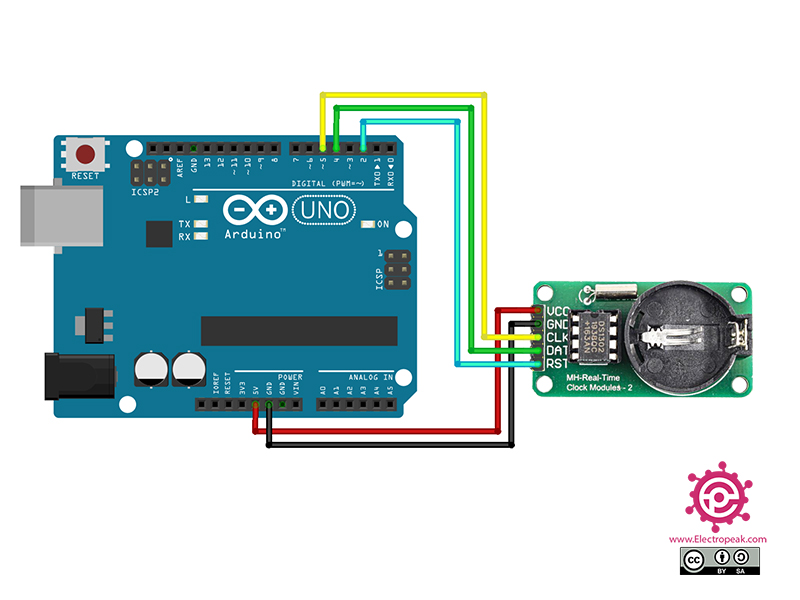

# Den store karse kop.


Dette dokument beskriver, hvordan man tester de enkelte komponenter i det store karse kop system. Test af de enkelte komponenter inden I sætter dem sammen, kan spare jer for meget tid og frustrationer forbundet med fejlfinding. Typiske årsager til fejl er:

- Forkert tilslutning af komponenter
- Manglende biblioteker
- Ledninger der ikke sidder ordentligt fast / er knækket

Lad ledningerne sidde i komponenten efter hver test.

## Test af Arduino Komponenter

### LiquidCrystal_I2C - 4 pin LCD display

LCD displayet skal bruges til at vise data fra de forskellige sensorer. Ved hele tiden at vise de forskellige sensorers output, kan man se om komponenterne stadig virker som de skal. Det er et 16x2 display, hvilket betyder at det kan vise 16 karakterer i bredden og 2 linjer i højden.
Detaljeret beskrivelse af LiquidCrystal_I2C biblioteket kan finde her: https://arduinogetstarted.com/tutorials/arduino-lcd-i2c?utm_content=cmp-true.

#### Installation

For at installere biblioteket, gå til Tools -> Manage Libraries og søg efter "LiquidCrystal_I2C". Installer biblioteket vist på billedet.

> Det er vigtigt at du vælger det rigtige bibliotek, da der findes flere forskellige versioner.


#### Forbindelser til Arduino Uno

På bagsiden af displayet er der vist en oversigt over de forskellige ben. For at tilslutte displayet til Arduino Uno, skal du bruge følgende forbindelser:

| LCD | Arduino Uno |
| --- | ----------- |
| GND | GND         |
| VCC | 5V          |
| SDA | A4          |
| SCL | A5          |


#### Kode til afprøvning

```c++
#include <Wire.h>
#include <LiquidCrystal_I2C.h>

// Set the LCD address to 0x27 for a 16 chars and 2 line display
LiquidCrystal_I2C lcd(0x27, 16, 2);

void setup()
{
  // initialize the LCD
  lcd.init();

  // Turn on the blacklight
  lcd.setBacklight((uint8_t)1);

  // First row
  lcd.print("Hello, world!");

  // Second row
  lcd.setCursor(0,1);
  lcd.print("Data Science");
}

void loop()
{
  // Do nothing here...
}
```

- Initialisering: Funktionen `lcd.init()` initialiserer displayet og sætter det op til brug. Her definerer man også displayets dimensioner, som i eksemplet er sat til 16 karakterer i bredden og 2 linjer i højden.
- Baggrundslys: Funktionen `lcd.setBacklight()` styrer baggrundslyset på LCD-displayet, hvilket gør det muligt at se teksten under forskellige lysforhold.
- placering af Cursor: Med `lcd.setCursor()` kan man bestemme hvor på skærmen den efterfølgende tekst skal vises. Dette giver fleksibilitet i visningen af data.
- Visning af Tekst: Funktionen `lcd.print()` bruges til at vise tekst på displayet. Teksten kan indeholde bogstaver, tal og specialtegn.

### DHT11 - Temperatur og luftfugtighed

DHT11 er en almindeligt anvendt sensor til måling af temperatur og luftfugtighed, som er nem at anvende med mikrocontrollere som Arduino. Her er de primære funktioner for DHT11:

- Temperaturmåling: DHT11 kan måle omgivelsestemperaturen med en præcision på ±2°C og et måleområde fra 0°C til 50°C.
- Fugtighedsmåling: Sensoren kan også måle relativ luftfugtighed med en præcision på ±5% RH og i området fra 20% til 80% RH.
- Digital Signal Output: DHT11 sender data som et digitalt signal, hvilket reducerer risikoen for signalforstyrrelser over lange afstande.
- Enkel Interface: Sensoren kræver kun én digital pin på Arduino til dataoverførsel, samt en strømforsyning og jordforbindelse.

Der findes mange biblioteker og udgaver. Den version I har er 3-pins versionen beskrevet her: https://www.circuitbasics.com/how-to-set-up-the-dht11-humidity-sensor-on-an-arduino/

For at installere biblioteket, gå til Tools -> Manage Libraries og søg efter "DHTlib" af Rob Tillaart.

#### Forbindelser til Arduino Uno

| DHT11 | Arduino Uno |
| ----- | ----------- |
| DATA  | 7           |
| VCC   | 5V          |
| GND   | GND         |


#### Kode til afprøvning

```c++
#include <dht.h>

dht DHT;

#define DHT11_PIN 7

void setup(){
  Serial.begin(9600);
}

void loop(){
  int chk = DHT.read11(DHT11_PIN);
  Serial.print("Temperature = ");
  Serial.println(DHT.temperature);
  Serial.print("Humidity = ");
  Serial.println(DHT.humidity);
  delay(1000);
}
```

I det ovenstående Arduino-kodeeksempel indlæses data fra DHT11-sensoren ved hjælp af DHT.read11(DHT11_PIN)-funktionen, hvor DHT11_PIN repræsenterer den digitale pin på Arduino-boardet, som sensoren er tilsluttet til. Når data er indlæst, kan temperatur og fugtighed aflæses fra DHT.temperature og DHT.humidity. Disse værdier udskrives derefter til seriel monitor hvert sekund (1000 millisekunder), som angivet af delay(1000)-funktionen.

### VL53L1X - Laser afstandsmåler

VL53L1X er en laser afstandsmåler sensor, der bruger en Time of Flight (ToF) sensor. Denne sensor kan måle afstande præcist ved at sende en laserpuls og måle den tid det tager for lyset at blive reflekteret tilbage til sensoren. Her er nogle af de centrale funktioner for VL53L1X:

- Lang Rækkevidde: Sensoren kan måle afstande fra 40mm op til 4 meter, hvilket er betydeligt længere end mange andre ToF-sensorer.
- Høj Nøjagtighed: VL53L1X tilbyder en imponerende nøjagtighed på ±5mm i optimal betingelser.
- Beskrivelse: https://www.waveshare.com/w/upload/7/7c/VL53L1X-Distance-Sensor-User-Manual-en.pdf

#### Installation

Kopier følgende ind i Arduino IDE og klik på linket og installer biblioteket.

```c++
//Click here to get the library: http://librarymanager/All#SparkFun_VL53L1X
```


#### Forbindelser til Arduino Uno

Indsæt 6PIN ledningen med hanner (dem med spids) i laserafstandsmåleren. Forbind nu laser afstandsmåleren til Arduino som vist nedenfor. Ignorer de kabler, som ikke forbindes til Arduino.

**OBS** Husk at fjerne vakumtapen fra afstandsmåleren.

| VL53L1X | Arduino Uno |
| ------- | ----------- |
| SORT    | GND         |
| RØD     | 3.3V        |
| BLÅ     | SDA         |
| GUL     | SCL         |


#### Kode til afprøvning

```c++
#include <Wire.h>
#include "SparkFun_VL53L1X.h" //Click here to get the library: http://librarymanager/All#SparkFun_VL53L1X


SFEVL53L1X distanceSensor;
//Uncomment the following line to use the optional shutdown and interrupt pins.
//SFEVL53L1X distanceSensor(Wire, SHUTDOWN_PIN, INTERRUPT_PIN);

void setup(void)
{
  Wire.begin();

  Serial.begin(9600);
  Serial.println("VL53L1X Qwiic Test");

  if (distanceSensor.begin() != 0) //Begin returns 0 on a good init
  {
    Serial.println("Sensor failed to begin. Please check wiring. Freezing...");
    while (1)
      ;
  }
  Serial.println("Sensor online!");
}

void loop(void)
{
  distanceSensor.startRanging(); //Write configuration bytes to initiate measurement
  while (!distanceSensor.checkForDataReady())
  {
    delay(1);
  }
  int distance = distanceSensor.getDistance(); //Get the result of the measurement from the sensor
  distanceSensor.clearInterrupt();
  distanceSensor.stopRanging();

  Serial.print("Distance(mm): ");
  Serial.print(distance);

  float distanceInches = distance * 0.0393701;
  float distanceFeet = distanceInches / 12.0;

  Serial.print("\tDistance(ft): ");
  Serial.print(distanceFeet, 2);

  Serial.println();

  delay(1000);
}
```

I det ovenstående Arduino-kodeeksempel oprettes et objekt SFEVL53L1X distanceSensor til at interagere med VL53L1X lasersensoren. I void setup()-funktionen initialiseres sensoren og der tjekkes for en succesfuld opstart, hvis afstand er forskellig fra 0. I void loop()-funktionen foretages der gentagne målinger af afstanden ved hjælp af distanceSensor.getDistance(), hvor afstanden måles i millimeter og konverteres til feet. Disse værdier udskrives til serial monitor. Efter hver måling indføres en pause på et sekund (1000 millisekunder) med delay(1000)-funktionen, før den næste måling påbegyndes.

### SD kortlæser

SD kortlæseren bruges til at samle data op for fra jeres sensorer. En beskrivelse af modulet findes her: https://lastminuteengineers.com/arduino-micro-sd-card-module-tutorial/?utm_content=cmp-true

#### Forbindelser til Arduino Uno


#### Kode til afprøvning

```c++
//Følgende tre linjer SKAL være før void setup
#include <SPI.h>
#include <SD.h>
File myFile;

void setup() {
  // Følgende linjer SKAL være i void setup

    // Open serial communications and wait for port to open:
  Serial.begin(9600);

  while (!Serial) {
    ; // wait for serial port to connect. Needed for native USB port only
  }
  Serial.print("Initializing SD card...");
  if (!SD.begin(10)) {   //Tallet i parentesen skal være det pinnummer, I har tildelt CS fra modulet til jeres SD-læser
    Serial.println("initialization failed!");
    while (1);
  }
  Serial.println("initialization done.");


// Du kan evt lave en heading i toppen af filen, hvor hver parameter (kolonne) bliver defineret ved navn. Hvis I gør dette, så indkludér dette i void loop
//myFile = SD.open("test.txt", FILE_WRITE);
  //myFile.print("Parameter 1");
  //myFile.print("\t"); //Dette angiver at vi starter en ny kolonne
  //myFile.println("Parameter 2"); //Den sidste kolonne, der er på en linje, skal kaldes "println" for at der starter en ny linje til næste skriv
//myFile.close();

}

void loop() {
  // følgende linjer kan indsættes i bunden af jeres loop, sådan at loopet afslutter med at gemme data
myFile = SD.open("test.txt", FILE_WRITE);

// if the file opened okay, write to it:
  if (myFile) {
   myFile.print("Parameter 1"); //Her skriver du, den værdi der skal gemmes for Parameter 1.
   myFile.print("\t"); //Dette angiver at vi starter en ny kolonne. Du kan altid tilføje paramtetre, der skal gemmes.
   myFile.println("Parameter 2"); //Her skriver du, den værdi der skal gemmes for Parameter 1. Den sidste kolonne, der er på en linje, skal kaldes "println" for at der starter en ny linje til næste skriv
   myFile.close();
   delay(1000);

  } else {
    // if the file didn't open, print an error:
    Serial.println("error opening test.txt");
  }

}
```

### RTC - Real Time Clock

Guide: https://electropeak.com/learn/interfacing-ds1302-real-time-clock-rtc-module-with-arduino/

#### Installation

Gå til Tools -> Manage Libraries og søg efter "Rtc by Makuna" by Michael C. Miller. Installer biblioteket.


#### Forbindelser til Arduino Uno

| RTC | Arduino Uno |
| --- | ----------- |
| GND | GND         |
| VCC | 5V          |
| CLK | 5           |
| DAT | 4           |
| RST | 2           |



#### Kode til afprøvning

```c++
#include <ThreeWire.h>  
#include <RtcDS1302.h>

// RTC setup
ThreeWire myWire(4,5,2); // IO, SCLK, CE
RtcDS1302<ThreeWire> Rtc(myWire);


void setup() {
  Serial.begin(9600);

  // RTC
  Rtc.Begin();

}

void loop() {

  // Get current date and time from RTC
  RtcDateTime now = Rtc.GetDateTime();
  Serial.print(now.Day());
  Serial.print('/');
  Serial.print(now.Month());
  Serial.print('/');
  Serial.print(now.Year());
  Serial.print("\t");
  Serial.print(now.Hour());
  Serial.print(':');
  Serial.print(now.Minute());
  Serial.print(':');
  Serial.print(now.Second());
  Serial.print("\t");
  Serial.print("\n");
 // Delay before next loop iteration
  delay(2000);

}
```

### Light Sensor (Photoresistor)

En lyssensor eller fotoresistor er en type resistor, hvis modstand ændrer sig afhængigt af mængden af lys, den bliver udsat for. Generelt set, når lyset bliver stærkere, falder modstanden, og når det er mørkere, stiger modstanden. Fotoresistorer er ofte anvendt i elektroniske projekter, hvor der er brug for en simpel og billig måde at måle lysintensitet.

Guide: https://www.instructables.com/How-to-use-a-photoresistor-or-photocell-Arduino-Tu/

#### Installation

Det er ikke nødvendigt at installere et biblotek for denne komponent.
**OBS** Anvend en 10 KOhm modstand.

#### Forbindelser til Arduino Uno


#### Kode til afprøvning

```c++
int sensorValue = 0;

void setup()
{
  pinMode(A0, INPUT);
  Serial.begin(9600);
}

void loop()
{
  // read the value from the sensor
  int lightRaw = analogRead(A0);
  // print the sensor reading so you know its range
  int light = map(lightRaw, 0, 1023, 0, 100);
  Serial.println(light);

  delay(1000); // Wait for 1 second

}
```

## Test af alle sensorer

Slutteligt kan alle sensorer sættes sammen og testes. I kan bruge følgende kode til at teste om alle tingene har forbindelse. Til dette skal i bruge thredboarded (den lange hvide firkant), så I kan forbinde flere komponenter til de samme porte på Arduinoen.

[Setup](./images/setup.png)

```c++
#include <Wire.h>
#include <LiquidCrystal_I2C.h>
#include <dht.h>
#include "SparkFun_VL53L1X.h"
#include <SPI.h>
#include <SD.h>
#include <ThreeWire.h>  
#include <RtcDS1302.h>

// LCD setup
LiquidCrystal_I2C lcd(0x27, 16, 2);

// DHT setup
dht DHT;
#define DHT11_PIN 7

// VL53L1X setup
SFEVL53L1X distanceSensor;

// RTC setup
ThreeWire myWire(4,5,2); // IO, SCLK, CE
RtcDS1302<ThreeWire> Rtc(myWire);

// SD card setup
File myFile;
const int chipSelect = 10;

void setup() {
  Serial.begin(9600);
  pinMode(A0, INPUT);  // Light sensor setup

  // LCD
  lcd.init();
  lcd.setBacklight((uint8_t)1);

  // DHT11 (no explicit initialization required)

  // VL53L1X distance sensor
  Wire.begin();
  if (distanceSensor.begin() != 0) {
    Serial.println("VL53L1X sensor initialization failed");
    while (1);
  }

  // SD card
  Serial.print("Initializing SD card...");
  if (!SD.begin(10)) {   //Tallet i parentesen skal være det pinnummer, I har tildelt CS fra modulet til jeres SD-læser
    Serial.println("initialization failed!");
    while (1);
  }
  Serial.println("initialization done.");


  // RTC
  Rtc.Begin();


  // Log headers to SD card
  myFile = SD.open("log.txt", FILE_WRITE);
  if (myFile) {
    myFile.print("Date");
    myFile.print("\t");
    myFile.print("Time");
    myFile.print("\t");
    myFile.print("Temperature (C)");
    myFile.print("\t");
    myFile.print("Humidity (%)");
    myFile.print("\t");
    myFile.print("Distance (mm)");
    myFile.print("\t");
    myFile.print("Light (0-100)");
    myFile.print("\n");
    myFile.close();
  } else {
    Serial.println("Error opening log.txt");
  }
}

void loop() {
  // Read from DHT11
  DHT.read11(DHT11_PIN);
  float temperature = DHT.temperature;
  float humidity = DHT.humidity;

  // Read from VL53L1X
  distanceSensor.startRanging();
  while (!distanceSensor.checkForDataReady()) {
    delay(1);
  }
  int distance = distanceSensor.getDistance();
  distanceSensor.clearInterrupt();
  distanceSensor.stopRanging();

  // Read light level
  int lightRaw = analogRead(A0);
  int light = map(lightRaw, 0, 1023, 0, 100);

  // Get current date and time from RTC
  RtcDateTime now = Rtc.GetDateTime();

  // Update LCD for temperature and humidity
  lcd.clear();
  lcd.setCursor(0, 0);
  lcd.print("Temp: ");
  lcd.print(temperature);
  lcd.print("C ");
  lcd.setCursor(0, 1);
  lcd.print("Humidity: ");
  lcd.print(humidity);
  lcd.print("%");
  delay(2000);

  // Update LCD for distance and light
  lcd.clear();
  lcd.setCursor(0, 0);
  lcd.print("Dist: ");
  lcd.print(distance);
  lcd.print("mm");
  lcd.setCursor(0, 1);
  lcd.print("Light: ");
  lcd.print(light);
  lcd.print("%");

  // Log data to SD card
  myFile = SD.open("log.txt", FILE_WRITE);
  if (myFile) {
    myFile.print(now.Day());
    myFile.print('/');
    myFile.print(now.Month());
    myFile.print('/');
    myFile.print(now.Year());
    myFile.print("\t");
    myFile.print(now.Hour());
    myFile.print(':');
    myFile.print(now.Minute());
    myFile.print(':');
    myFile.print(now.Second());
    myFile.print("\t");
    myFile.print(temperature);
    myFile.print("\t");
    myFile.print(humidity);
    myFile.print("\t");
    myFile.print(distance);
    myFile.print("\t");
    myFile.println(light);
    myFile.close();
  } else {
    // if the file didn't open, print an error:
    Serial.println("Error opening log.txt");
    // You might also want to display an error on the LCD here
    lcd.clear();
    lcd.setCursor(0, 0);
    lcd.print("Error opening");
    lcd.setCursor(0, 1);
    lcd.print("log.txt");
  }

  // Delay before next loop iteration
  delay(2000);
}
```
