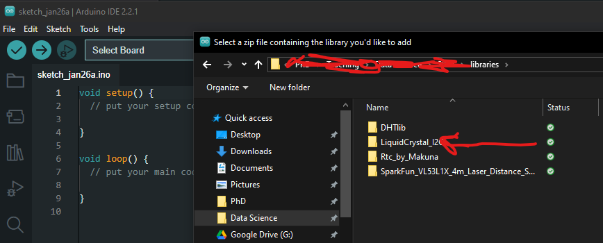
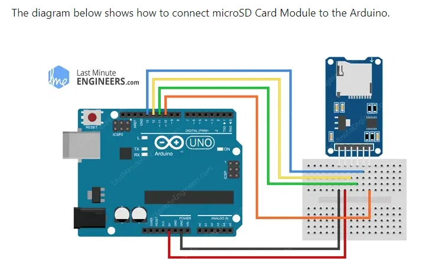

# Guide til komponenter

Dette dokument beskriver, hvordan man tester de enkelte arduino komponenter til den store surdejskonkurrence. Test af de enkelte komponenter inden I sætter dem sammen, kan spare jer for meget tid og frustrationer forbundet med fejlfinding. Typiske årsager til fejl er:

- Forkert tilslutning af komponenter
- Manglende eller forkerte biblioteker
- Ledninger der ikke sidder ordentligt fast / er knækket

Lad ledningerne sidde i komponenten efter hver test. Benyt breadbordet til at teste de enkelte komponenter. Dette kan spare jer en masse besvær, når I skal til at sætte flere komponenter sammen.

## Test af Arduino Komponenter

### LiquidCrystal_I2C - 4 pin LCD display

LCD displayet skal bruges til at vise data fra de forskellige sensorer. Ved hele tiden at vise de forskellige sensorers output, kan man se om komponenterne stadig virker som de skal. Det er et 16x2 display, hvilket betyder at det kan vise 16 karakterer i bredden og 2 linjer i højden.
Detaljeret beskrivelse af LiquidCrystal_I2C biblioteket kan findes her: https://arduinogetstarted.com/tutorials/arduino-lcd-i2c?utm_content=cmp-true. \

#### Installation

For at installere biblioteket download `LiquidCrystal_I2C.zip` filen i libraries mappen og installer den i Arduino IDE.




I kan finde lokationen til jeres `libraries` folder ved trykke **File** > **Preferences** > **Sketchbook location**. Hvis `libraries` mappen ikke allerede findes på denne lokation, så kan I lave en ny mappe og tilføje jeres bibloteker hertil. Biblotekerne skal være unzipped!


#### Forbindelser til Arduino Uno

På bagsiden af displayet er der vist en oversigt over de forskellige ben. For at tilslutte displayet til Arduino Uno, skal du bruge følgende forbindelser:

| LCD | Arduino Uno |
| --- | ----------- |
| GND | GND         |
| VCC | 5V          |
| SDA | SDA          |
| SCL | SCL          |


**OBS** - Hvis jeres LCD-display ikke umiddelbart viser text, når I uploader jeres sketch uden fejlmeddelelser kan det skyldes at kontrasten skal justeres. Dette kan gøres ved at dreje på skruen på bagsiden af displayet.

#### Kode til afprøvning

```c++
#include <Wire.h>
#include <LiquidCrystal_I2C.h>

// Først skal vi initialisere LCD-displayet og angiver dets dimensioner. Her er det 16 karakterer i bredden og 2 linjer i højden.
LiquidCrystal_I2C lcd(0x27, 16, 2);

void setup()
{
  // Start LCD displayet
  lcd.init();

  // Tænd baggrundslyset
  lcd.setBacklight((uint8_t)1);

  // Tilføj tekst til displayet
  lcd.print("Hello, world!");

  // Sæt cursor til at starte på linje 2
  lcd.setCursor(0,1);
  // Tilføj mere tekst
  lcd.print("Data Science");
}

void loop()
{
  // ...
}
```

- Initialisering: Funktionen `lcd.init()` initialiserer displayet og sætter det op til brug.
- Baggrundslys: Funktionen `lcd.setBacklight()` styrer baggrundslyset på LCD-displayet.
- placering af Cursor: Med `lcd.setCursor()` kan man bestemme hvor på skærmen den efterfølgende tekst skal vises. Dette giver fleksibilitet i visningen af data.
- Visning af Tekst: Funktionen `lcd.print()` bruges til at vise tekst på displayet. Teksten kan indeholde bogstaver, tal og specialtegn.

### DHT11 - Temperatur og luftfugtighed

DHT11 er en almindeligt anvendt sensor til måling af temperatur og luftfugtighed, som er nem at anvende med mikrocontrollere som Arduino. Her er de primære funktioner for DHT11:

- Temperaturmåling: DHT11 kan måle omgivelsestemperaturen med en præcision på ±2°C og et måleområde fra 0°C til 50°C.
- Fugtighedsmåling: Sensoren kan også måle relativ luftfugtighed med en præcision på ±5% RH og i området fra 20% til 80% RH.
- Digital Signal Output: DHT11 sender data som et digitalt signal, hvilket reducerer risikoen for signalforstyrrelser over lange afstande.
- Enkel Interface: Sensoren kræver kun én digital pin på Arduino til dataoverførsel, samt en strømforsyning og jordforbindelse.

#### Installation

Til temperatur og luftfugtigheds sensoren skal de bruges to biblioteker: `DHT_sensor_libray` og `Adafruit_Sensor-master` Download de to biblioteker i libraries mappen på github siden her og installer dem i Arduino IDE, som angivet for LCD-displayet.

#### Forbindelser til Arduino Uno

| DHT11 | Arduino Uno |
| ----- | ----------- |
| +     | 5V           |
| OUT   | 8          |
| -     | GND         |


#### Kode til afprøvning

```c++
#include "DHT.h"
#define DHTPIN 8    // Digital udgang forbundet til DHT sensor
#define DHTTYPE DHT11   // DHT 11
DHT dht(DHTPIN, DHTTYPE);

void setup() {
  Serial.begin(9600);

  dht.begin();
}

void loop(){
  Serial.print("Temperature = ");
  Serial.println(dht.readTemperature());
  Serial.print("Humidity = ");
  Serial.println(dht.readHumidity());
  delay(1000);
}
```

I det ovenstående Arduino-kodeeksempel indlæses data fra DHT11-sensoren via den digital indgang 8 på Arduino-boardet. Når data er indlæst, kan temperatur og fugtighed aflæses fra dht.temperature og dht.humidity. Disse værdier udskrives derefter til serial monitor hvert sekund (1000 millisekunder), som angivet af delay(1000)-funktionen. Tjek kode eksemplerne ud i `DHT_sensor_libray` for mere advanceret brug af dette bibliotek og DHT-sensoren.

### Sharp IR Sensor (GP2Y0A41SK0F) - Laser afstandsmåler

Sharp IR Sensor (GP2Y0A41SK0F) er en laser afstandsmåler sensor, der bruger triangulationsprincipper til at måle afstande. Sensoren har et måle område mellem 4 og 30 cm, men virker bedst og mest præcist mellem 4 og 15 cm. Sensoren fungerer ved at udsende en infrarød lysstråle, der reflekteres tilbage fra en genstand. Refleksionen opfanges af en positionsfølsom detektor (PSD) inde i sensoren, som beregner afstanden baseret på vinklen af den reflekterede stråle. Sensoren udsender en spænding som er omvendt proportional med afstanden til genstanden. Du kan læse mere om sensoren [her](https://www.instructables.com/How-to-Use-the-Sharp-IR-Sensor-GP2Y0A41SK0F-Arduin/).

#### Installation

Der skal ikke benyttes et biblotek til denne sensor.

#### Forbindelser til Arduino Uno

Indsæt 3PIN ledningen i laserafstandsmåleren. Forbind nu laser afstandsmåleren til Arduino som vist nedenfor. Det kan være nødvendigt at strippe ledningernes ender først.

**OBS** Hvis denne sensor ikke forbindes til jord korrekt, så overopheder den.

| IR Sensor | Arduino Uno |
| --------- | ----------- |
| SORT      | GND         |
| RØD       | 5V        |
| GUL       | A0          |


#### Kode til afprøvning

```c++
#define sensor A0 // Sharp IR GP2Y0A41SK0F (4-30cm, analog) - Definerer analog indgang for afstandssensor

void setup() {
  Serial.begin(9600); // start serial port
}

void loop() {
  
  // Måler distance med IR-afstandsmåler
  float volts = analogRead(sensor)*0.0048828125;  // Omregner værdi fra bit til volt: Værdi fra sensor * (5/1024)
  float distance = 13*pow(volts, -1); // Omregner volt til afstand (cm) vha. funktion for standardkurve
  
  if (distance <= 30){
    Serial.println(distance);
  }
}
```

I det ovenstående Arduino-kodeeksempel definere vi et sensor object, som repræsenterer analog indgang A0. I void loop() konveterer vi først signalet fra A0 til volt igen, da den analoge indgang konveterer spændingen til digital signal. Arduinoen er 10 bit. Det vil sige, at det analoge signals måleområde indeles i 2^10 = 1024 intervaler. For at omregne det digitale signal til volt igen, så skal gange det digitale signal med måleområdet (0V-5V) divideret med antal intervaler. Derefter bruger vi en funktion til at omregne spændingen til afstand i cm. Funktionen kommer fra standardkurven, som ikke kan finde i linket længere oppe.

### SD kortlæser

SD kortlæseren bruges til at gemme data fra jeres sensorer. En beskrivelse af modulet findes her: https://lastminuteengineers.com/arduino-micro-sd-card-module-tutorial/?utm_content=cmp-true

#### Forbindelser til Arduino Uno




#### Kode til afprøvning

```c++
//Følgende tre linjer SKAL være før void setup
#include <SPI.h>
#include <SD.h>
File myFile;

void setup() {
  Serial.begin(9600);

  while (!Serial) {
    ; // Vent på at seriel port er klar
  }
  Serial.print("Initializing SD card...");
  if (!SD.begin(10)) {   //Tallet i parentesen skal være den pin indgang, som er forbundet til CS på SD-kortlæseren
    Serial.println("initialization failed!");
    while (1);
  }
  Serial.println("initialization done.");


// Du kan evt lave en heading i toppen af filen, hvor hver parameter (kolonne) bliver defineret ved navn. Hvis I gør dette, så indkludér dette i void loop
//myFile = SD.open("test.txt", FILE_WRITE);
  //myFile.print("Parameter 1");
  //myFile.print("\t"); //Dette angiver at vi starter en ny kolonne
  //myFile.println("Parameter 2"); //Den sidste kolonne, der er på en linje, skal kaldes "println" for at der starter en ny linje til næste skriv
//myFile.close();

}

void loop() {
  // følgende linjer kan indsættes i bunden af jeres loop, sådan at loopet afslutter med at gemme data
myFile = SD.open("test.txt", FILE_WRITE);

// if the file opened okay, write to it:
  if (myFile) {
   myFile.print("Parameter 1"); //Her skriver du, den værdi der skal gemmes for Parameter 1.
   myFile.print("\t"); //Dette angiver at vi starter en ny kolonne. Du kan altid tilføje paramtetre, der skal gemmes.
   myFile.println("Parameter 2"); //Her skriver du, den værdi der skal gemmes for Parameter 1. Den sidste kolonne, der er på en linje, skal kaldes "println" for at der starter en ny linje til næste skriv
   myFile.close();
   delay(1000);

  } else {
    // if the file didn't open, print an error:
    Serial.println("error opening test.txt");
  }

}
```

## Sammensætning af 2 komponenter

Her vises et simpelt arduino script, hvor I kan se hvordan man måler temperaturen og fugtigheden med DHT11 og viser det på LCD displayet.

### LCD og DHT11

```c++
#include <Wire.h>
#include <LiquidCrystal_I2C.h>
#include "DHT.h"

// LCD setup
LiquidCrystal_I2C lcd(0x27, 16, 2);

// DHT setup
#define DHTPIN 7     // Digital udgang forbundet til DHT sensor
#define DHTTYPE DHT11   // DHT 11
DHT dht(DHTPIN, DHTTYPE);

void setup() {
  Serial.begin(9600);

  // start LCD
  lcd.init();
  lcd.setBacklight((uint8_t)1);

  dht.begin();

}

void loop() {
  /// Måler temperatur og luftfugtighed
  float temperature = dht.readTemperature();
  float humidity = dht.readHumidity();

  // Vis data på LCD
  lcd.clear();
  lcd.setCursor(0, 0);
  lcd.print("Temp: ");
  lcd.print(temperature);
  lcd.print("C ");
  lcd.setCursor(0, 1);
  lcd.print("Humidity: ");
  lcd.print(humidity);
  lcd.print("%");

  // Vent 2 sekunder
  delay(2000);
}
```
