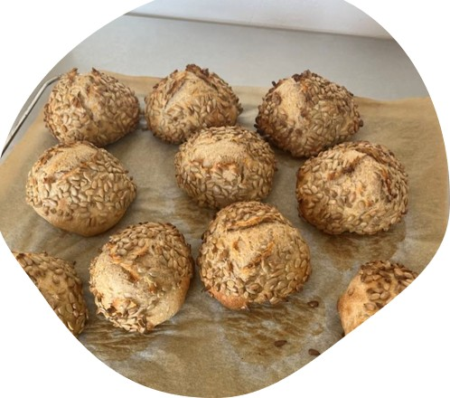

# Surdejsguide

## Opstart af surdejsstarter

Dag 0 - Du skal bruge 50 g økologisk hvedemel, 25 g økologisk hvedemel, 25 g økologisk rugmel og 3 dl koldt vand. Bland det sammen med hænderne, skrab kanterne og stil det lunt.

Dag 1-3 - Rør i surdejen morgen og aften med fingrene og skrab kanterne.

Dag 3-4 - Når surdejen bobler og dufter syrligt skal den fodres 1 gang om dagen. Nu stopper vi med at røre i den.

Dag 7 - Når den hæver op til dobbeltstørrelse efter 3-4 timer, så er din surdejsstarter klar til at bage med.

## Fodring af surdej

1) Bland 1 del surdej med 1 del mel og 1 del vand
2) Det er godt at bruge noget groft mel blandet med hvedemel til fodring. Grove meltyper er f.eks. fuldkornsmel, grahamsmel og rugmel.
3) Efter fodring vil surdejen hæve i løbet af de første timer.
4) Efter ca. 12-24 timer er surdejen faldet til sin start størrelse igen og nu er den klar til endnu en fodring. Ved stuetemperatur skal surdejen fodres 1 gang dagligt.

## Tips og Tricks
1) Det er bedst at bruge frisk og økologisk hvedemel, da det naturligt indeholder flere mikroorganismer.
2) Man kan sagtens nøjes med kun at bruge hvedemel til fodring. Men meltypen har meget at sige for aktiviteten af din surdejsstarter. 
3) Manitoba mel, tipo 00 og ølandshvedemel har f.eks. et højt glutenindhold, og er derfor gode til at bage med, men også til at sætte gang i din surdej.
4) Hvis du holder en surdejspause, så kan du opbevare din surdej i køleskabet. Her skal surdejen fodres ca. 1 gang om ugen. Lad gerne surdejen stå nogle timer på køkkenbordet efter fodring inden du igen sætter den på køl igen.
5) Her er en fin follow along guide.
https://www.youtube.com/watch?v=ZHm1aKxAsIs

## Opskrift
Opskrift på nemme [surdejsboller](https://www.valdemarsro.dk/surdejsboller/)

